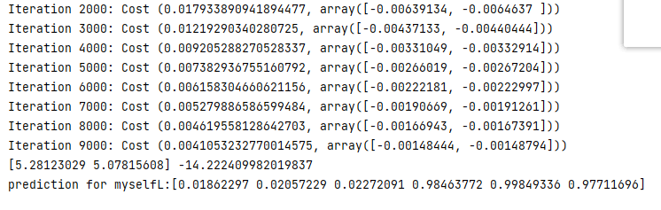
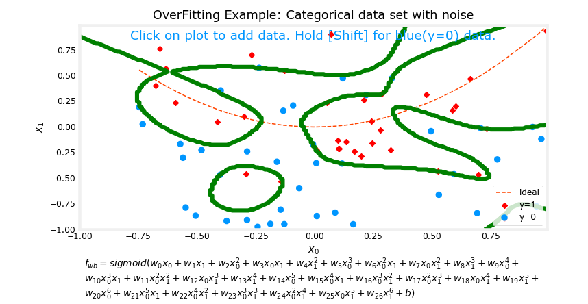
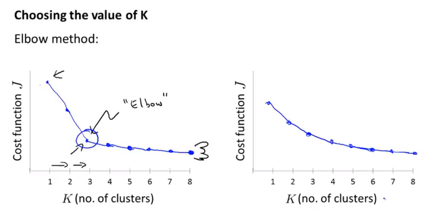

# Machine Learning

# 1. Supervised learning

## 1.1 Linear Regression Model(线性回归)

### (1) The model function

$$
f_{w,b}(x^{(i)})=wx^{(i)}+b
$$


- 主要是通过数据确定$w$和$b$,然后 输入一个值  预测 其对应的值.

- 预测函数代码实现：

```python
def predict(x,w,b):
    y = x*w + b
    return y
```

### (2) Cost Function

**Squared error cost:**
$$
J(w,b)=\frac{1}{2m}\sum^{m-1}_{i=0}({f_{w,b}(x^{(i)})-y^{(i)})}^2
$$

where	$f_{w,b}(x^{(i)})=wx^{(i)}+b$  

- $w,b$是我们训练的参数，$\frac{1}{2m}$里面的2是为了求偏导时,使后面的式子更简洁.

- $({f_{w,b}(x^{(i)})-y^{(i)})}^2$  是目标值与预测值的平均方差,我们自己训练出的$w,b$来计算y,与实际y值相减.

- 计算Cost Function的代码如下：

  ```python
  def cost_function(x,y,w,b):
      m = x.shape[0]
  
      cost_sum = 0 
      for i in range(m): 
          f_wb = w * x[i] + b   
          cost = (f_wb - y[i]) ** 2  
          cost_sum = cost_sum + cost
          
      total_cost = (1 / (2 * m)) * cost_sum  
  
  	return total_cost
  ```

  

### (3) Gradient Descent

$$
w=w-\alpha \frac{\partial{J(w,b)}}{\partial {w}}
$$

$$
b=b-\alpha \frac{\partial{J(w,b)}}{\partial b}
$$

> $\alpha$是学习率

 $J(w,b)$是一个如下图：


都可导，可通过梯度算法更新参数$w,b$,得到最小的$J$,从而得到最合理的$w,b$

#### (3.1) Batch Gradient Descent （批量梯度下降）

$$
\frac{\partial{J(w,b)}}{\partial w}=\frac{1}{m}\sum_{i=0}^{m-1}(f_{w,b}(x^{(i)})-y^{(i)})x^{(i)}
$$


$$
\frac{\partial{J(w,b)}}{\partial b}=\frac{1}{m}\sum_{i=0}^{m-1}(f_{w,b}(x^{(i)})-y^{(i)})
$$
代码实现方法：

```python
def gradient_function(x,y,w,b):
    m = x.shape[0]    
    dj_dw = 0
    dj_db = 0
    
    for i in range(m):  
        f_wb = w * x[i] + b 
        dj_dw_i = (f_wb - y[i]) * x[i] 
        dj_db_i = f_wb - y[i] 
        dj_db += dj_db_i
        dj_dw += dj_dw_i 
    dj_dw = dj_dw / m 
    dj_db = dj_db / m 
        
    return dj_dw, dj_db

def gradient_descent(x, y, w_in, b_in, alpha, num_iters, cost_function, gradient_function):
	w = copy.deepcopy(w_in) # avoid modifying global w_in
     J_history = []
    p_history = []
    b = b_in
    w = w_in
    
    for i in range(num_iters):
        # Calculate the gradient and update the parameters using gradient_function
        dj_dw, dj_db = gradient_function(x, y, w , b)     

        # Update Parameters using equation (3) above
        b = b - alpha * dj_db                            
        w = w - alpha * dj_dw                            

        # Save cost J at each iteration
        if i<100000:      # prevent resource exhaustion 
            J_history.append( cost_function(x, y, w , b))
            p_history.append([w,b])
            
        # Print cost every at intervals 10 times or as many iterations if < 10
        if i% math.ceil(num_iters/10) == 0:
            print(f"Iteration {i:4}: Cost {J_history[-1]:0.2e} ",
                  f"dj_dw: {dj_dw: 0.3e}, dj_db: {dj_db: 0.3e}  ",
                  f"w: {w: 0.3e}, b:{b: 0.5e}")
 
    return w, b, J_history, p_history #return w and J,w history for graphing
```


- 通过Cost function对参数求偏导

- 在大量数据中，每次梯度下降都要对所有样本计算，计算量大

#### (3.2) Stochastic Gradient Descent (随机梯度下降)

$$
\frac{\partial{J(w,b)}}{\partial b}=(f_{w,b}(x^{(i)}-y^{(i)})
$$

$$
\frac{\partial{J(w,b)}}{\partial b}=(f_{w,b}(x^{(i)}-y^{(i)})
$$


随机抽取某个数据来当做下降梯度，降低复杂度，但有较大的振荡.

#### (3.3) Small Batch Gradient Descent

 结合上述两个方法，随机抽取样本中一部分数据，公式为：
$$
\frac{\partial{J(w,b)}}{\partial w}=\frac{1}{k}\sum_{i}^{i+k}(f_{w,b}(x^{(i)})-y^{(i)})x^{(i)}
$$

$$
\frac{\partial{J(w,b)}}{\partial b}=\frac{1}{k}\sum_{i}^{i+k}(f_{w,b}(x^{(i)})-y^{(i)})
$$

通常最常用的也是小批量梯度下降算法，计算速度快，收敛稳定。

## 1.2 Multiple Variable Linear Regression (多元线性回归)

### (1) Model function

$$
f_{w,b}=w_0x_0+w_1x_1+...+w_{n-1}x_{n-1}+b
$$

在此模型中,有多个x值对最终结果y值有影响。

用向量表示为：
$$
f_{w,b}(\vec{x})=\vec{w}\cdot\vec{x}+b
$$

- 其中	$\vec{w}=\left[\begin{matrix} {w_1}\\w_2 \\... \\w_{n-1} \end{matrix} \right]$       $\vec x = \left(\begin{matrix} {x^{(0)}_0}   &{x_1^{(0)}} &{...} &{x_{n-1}^{(0)}}\\x_0^{(1)}  &{{x_1^{(1)}}} &{...} &{x_{n-1}^{(1)}} \\ ... \\ x_0^{(m-1)}  &{x_1^{(m-1)}} &{...} &{x_{n-1}^{(m-1)}} \end{matrix}\right)$


- 预测函数代码实现：

- ```python
  def predict(x,w,b):
      y = np.dot(x,w)+b
      return y
  ```

### (2) Cost function

$$
J(\vec w,b)=\frac{1}{2m}\sum_{i=0}^{m-1}(f_{\vec w,b}(X^{(i)}-y^{(i)}))^2
$$

where 
$$
f_{\vec w,b}(X^{(i)})=\vec w \cdot \vec x^{(i)} + b
$$

- $i$代表样本, 实际中是第几行

- 计算Cost function的代码如下：

  ```python
  def cost_function(X, y, w, b): 
      m = X.shape[0] #0表示行
      cost = 0.0
      for i in range(m):                                
          f_wb_i = np.dot(X[i], w) + b           #(n,)(n,) = scalar (see np.dot)
          cost = cost + (f_wb_i - y[i])**2       #scalar
      cost = cost / (2 * m)                      #scalar    
      return cost
  ```


###  (3) Gradient Descent

$$
\begin{align} & repeat \space until \space convergence: \{ \\ & {w_j=w_j-\alpha\frac{\partial{J(\bold w,b)}}{\part w_ j}} \space \space for\space j=0,...n-1 \\ &{b=b-\alpha\frac{\partial{J(\bold w,b)}}{\part b}}  \\ \} \end{align}
$$

​		where n是特征的数量，$w_ j,b$是更新的参数,其中：
$$
\begin{align} &\frac{\part J(\bold w,b)}{\part w_j}=\frac{1}{m}\sum_{i=0}^{m-1}(f_{\bold w,b}(\bold X^{(i)})-y^{(i)})x^{(i)}_j
\\
&\frac{\part J(\bold w,b)}{\part b}=\frac{1}{m}\sum_{i=0}^{m-1}(f_{\bold w,b}(\bold X^{(i)})-y^{(i)})
\end{align}
$$

- m是训练样本个数

- $f_{\bold w,b}(\bold X^{(i)})$是自己训练出的预测值，$y^{(i)}$是实际目标值

- 实现代码如下：

  ```python
  def gradient_function(X, y, w, b):
      m,n = X.shape           #(number of examples, number of features)
      dj_dw = np.zeros((n,))
      dj_db = 0.
  
      for i in range(m):                             
          err = (np.dot(X[i], w) + b) - y[i]   
          for j in range(n):                         
              dj_dw[j] = dj_dw[j] + err * X[i, j]    
          dj_db = dj_db + err                        
      dj_dw = dj_dw / m                                
      dj_db = dj_db / m                                
          
      return dj_db, dj_dw
  def gradient_descent(X, y, w_in, b_in, cost_function, gradient_function, alpha, num_iters): 
      J_history = []
      w = copy.deepcopy(w_in)  #avoid modifying global w within function
      b = b_in
      
      for i in range(num_iters):
  
          # Calculate the gradient and update the parameters
          dj_db,dj_dw = gradient_function(X, y, w, b)   ##None
  
          # Update Parameters using w, b, alpha and gradient
          w = w - alpha * dj_dw               ##None
          b = b - alpha * dj_db               ##None
        
          # Save cost J at each iteration
          if i<100000:      # prevent resource exhaustion 
              J_history.append( cost_function(X, y, w, b))
  
          # Print cost every at intervals 10 times or as many iterations if < 10
          if i% math.ceil(num_iters / 10) == 0:
              print(f"Iteration {i:4d}: Cost {J_history[-1]:8.2f}   ")
          
      return w, b, J_history #return final w,b and J history for graphing
  ```

###  (4)Feature Scaling

- 由于每个指标的值都不一样,有些值可能相差很大,导致在迭代计算参数$\vec w,b$时，可能会出现不收敛的情况，需采用特征缩放(Feature Scaling)

- 线性回归问题中常采用的是 z-score normalization,其公式为：
  $$
  x_j^{(i)} = \frac{x_j^{(i)}-\mu_j}{\sigma_j}
  $$
  其中j是 特征即列，$u_j$是样本中该特征的均值，$\sigma_j$是样本中该特征的标准差（用样本均值和标准差代替该问题的均值和方差）,具体公式如下：
  $$
  \begin{align}
  &u_j=\frac{1}{m}\sum_{i=0}^{m-1}x^{(i)}_{j} \\
  &\sigma_j^2=\frac{1}{m}\sum_{i=0}^{m-1}(x_j^{(i)}-\mu_j)^2
  \end{align}
  $$

- 实现代码如下：

  ```python
  def zscore_normalize_features(X):
      # find the mean of each column/feature
      mu     = np.mean(X, axis=0)                 # mu will have shape (n,)
      # find the standard deviation of each column/feature
      sigma  = np.std(X, axis=0)                  # sigma will have shape (n,)
      # element-wise, subtract mu for that column from each example, divide by std for that column
      X_norm = (X - mu) / sigma      
  
      return (X_norm, mu, sigma)
  ```


### (5) Polynomial Regression

- 采用多项式拟合数据，如：$y=1+x^2$

- 采用目标函数：$y=w_0x_0^2+b$,输入数据时我们直接将$X^2$,这一步称为Feature Engineering示范代码如下：

  ```python
  x = np.arange(0, 20, 1)
  y = 1 + x**2
  
  # Engineer features 
  X = x**2      #<-- added engineered feature
  
  X = X.reshape(-1, 1)  #X should be a 2-D Matrix
  model_w,model_b = run_gradient_descent_feng(X, y, iterations=10000, alpha = 1e-5)
  ```

- 如果我们采用模型（目标）函数为：$y=w_0x_0+w_1x_1^2+w_2x_2^3+b$，Feature Engineering代码如下：

  ```python
  x = np.arange(0, 20, 1)
  y = x**2
  
  # engineer features .
  X = np.c_[x, x**2, x**3]   #<-- added engineered feature
  model_w,model_b = run_gradient_descent_feng(X, y, iterations=10000, alpha=1e-7)
  ```

从该模型我们得出$\bold {\overrightarrow w}=[0.08 \space 0.54 \space 0.03]$,$x^2$项的系数明显远大于其余项的系数

> Gradient descent is picking the 'correct' features for us by emphasizing its associated parameter

- Intially, the features were re-scaled so they are comparable to each other
- less weight value implies less important/correct feature, and in extreme, when the weight becomes zero or very close to zero, the associated feature useful in fitting the model to the data.
- above, after fitting, the weight associated with the $x^2$ feature is much larger than the weights for $x$ or $x^3$ as it is the most useful in fitting the data.

##  Linear Regression by using skLearn

- MyDemo: 

  ```python 
  import numpy as np
  from sklearn.linear_model import LinearRegression,SGDRegressor
  from sklearn.preprocessing import StandardScaler
  import matplotlib.pyplot as plt
  import copy, math
  
  def zscore_normalize_features(X):
      # find the mean of each column/feature
      mu     = np.mean(X, axis=0)                 # mu will have shape (n,)
      # find the standard deviation of each column/feature
      sigma  = np.std(X, axis=0)                  # sigma will have shape (n,)
      # element-wise, subtract mu for that column from each example, divide by std for that column
      X_norm = (X - mu) / sigma
  
      return (X_norm, mu, sigma)
  
  def gradient_function(X, y, w, b):
      m, n = X.shape  # (number of examples, number of features)
      dj_dw = np.zeros((n,))
      dj_db = 0.
  
      for i in range(m):
          err = (np.dot(X[i], w) + b) - y[i]
          for j in range(n):
              dj_dw[j] = dj_dw[j] + err * X[i, j]
          dj_db = dj_db + err
      dj_dw = dj_dw / m
      dj_db = dj_db / m
      
      return dj_db, dj_dw
  
  def cost_function(X, y, w, b):
      m = X.shape[0] #0表示行
      cost = 0.0
      for i in range(m):
          f_wb_i = np.dot(X[i], w) + b           #(n,)(n,) = scalar (see np.dot)
          cost = cost + (f_wb_i - y[i])**2       #scalar
      cost = cost / (2 * m)                      #scalar
      return cost
  
  def gradient_descent(X, y, w_in, b_in, cost_function, gradient_function, alpha, num_iters):
      J_history = []
      w = copy.deepcopy(w_in)  # avoid modifying global w within function
      b = b_in
  
      for i in range(num_iters):
      
          # Calculate the gradient and update the parameters
          dj_db, dj_dw = gradient_function(X, y, w, b)  ##None
      
          # Update Parameters using w, b, alpha and gradient
          w = w - alpha * dj_dw  ##None
          b = b - alpha * dj_db  ##None
      
          # Save cost J at each iteration
          if i < 100000:  # prevent resource exhaustion
              J_history.append(cost_function(X, y, w, b))
      
          # Print cost every at intervals 10 times or as many iterations if < 10
          if i % math.ceil(num_iters / 10) == 0:
              print(f"Iteration {i:4d}: Cost {J_history[-1]:8.2f}   ")
      
      return w, b, J_history  # return final w,b and J history for graphing
  
  def predict(x,w,b):
      y = np.dot(x,w)+b
      return y
  
  def load_data():
      data = np.loadtxt("./data/houses.txt", delimiter=',', skiprows=1)
      X = data[:,:4]
      y = data[:,4]
      return X, y
  
  # 读数据
  X_train, y_train = load_data()
  X_features = ['size(sqft)','bedrooms','floors','age']
  
  """
  sklearn using
  1、多项式回归
  2、单一项回归
  """
  
  """
  以下是：
  1、多项式回归
  """
  #1 预处理
  scaler = StandardScaler()
  X_norm = scaler.fit_transform(X_train)
  
  #2 设置参数，并训练模型
  """
  np.ptp 从列出发或行出发，找出最大值到最小值的范围
  """
  print(f"Peak to Peak range by column in Raw        X:{np.ptp(X_train,axis=0)}")
  print(f"Peak to Peak range by column in Normalized X:{np.ptp(X_norm,axis=0)}")
  sgdr = SGDRegressor(max_iter=1000)
  sgdr.fit(X_norm, y_train)
  print(sgdr)
  print(f"number of iterations completed: {sgdr.n_iter_}, number of weight updates: {sgdr.t_}")
  
  #3 得到训练后的参数
  b_norm = sgdr.intercept_
  w_norm = sgdr.coef_
  print(f"model parameters:                   w: {w_norm}, b:{b_norm}")
  #print(f"model parameters from previous lab: w: [110.56 -21.27 -32.71 -37.97], b: 363.16")
  
  #4 预测数据，得到结果
  y_pred_sgd = sgdr.predict(X_norm)
  y_pred = np.dot(X_norm, w_norm) + b_norm
  print(f"prediction using np.dot() and sgdr.predict match: {(y_pred == y_pred_sgd).all()}")
  print(f"Prediction on training set:\n{y_pred[:4]}" )
  print(f"Target values \n{y_train[:4]}")
  
  """
  My idea
  """
  # 自己的 归一化函数
  (my_norm,m,u) = zscore_normalize_features(X_train)
  print(f"my norm and sklearn norm: {(my_norm == X_norm).all()}")
  # 结果相同
  w_init = np.array([ 0.39133535, 18.75376741, -53.36032453, -26.42131618])
  my_w_in = np.array([ 110, -21, -32, -38])
  
  initial_b = 362
  alpha = 5.0e-7
  
  w_fial,b_final,J_hist =gradient_descent(my_norm,y_train,my_w_in,initial_b,cost_function,gradient_function,alpha,10000)
  print(f"my_model w:{w_fial} b:{b_final}")
  my_y = predict(my_norm,w_fial,b_final)
  # print(my_y)
  
  print(f"my_predict:{my_y[:4]}",f"actual y:{y_train[:4]}")
  
  """
  思考：
  选择与sklearn的参数相近的参数
  自己的模型 损失函数基本不变了，但 与最终y值 相差仍然较大，不如sklearn的结果好！  与初始参数选择有关？ 
  ！！是否与迭代次数有关？！！
  """
  
  """
  以下是：
  2、单一项回归
  """
  
  X_train = np.array([1.0, 2.0])   #features
  y_train = np.array([300, 500])   #target value
  linear_model = LinearRegression()
  linear_model.fit(X_train.reshape(-1,1),y_train)#X must be a 2-D Matrix
  b = linear_model.intercept_
  w = linear_model.coef_
  print(f"w = {w:}, b = {b:0.2f}")
  # print(f"'manual' prediction: f_wb = wx+b : {1200*w + b}")
  y_pred = linear_model.predict(X_train.reshape(-1, 1))
  
  print("Prediction on training set:", y_pred)
  
  X_test = np.array([[1200]])
  print(f"Prediction for 1200 sqft house: ${linear_model.predict(X_test)[0]:0.2f}")
  
  ```

  </details>

- 运行结果如下图：

- 


## 1.4 Logistic Regression

- Almost used in Classification,Our actual question is:

<table>
    <tr>
        <td>Question</td>
        <td colspan="2">Answer"y"</td>
    <tr>
    <tr>
        <td>Is the email spam?</td>
        <td>yes(1)</td>
        <td>No(0)</td>
    <tr>    
</table>

- Some Example:
  

**If we still use Liner Regression to fit these data, we will get:**


Vissablely,the reslut is not good for our actual problem.So,we must use some tool to deal with this problem.

We introduce some tool:

### (1) sigmoid function

$$
g = \frac{1}{1+e^{-Z}}
$$

- Its image of g(Z):

  

As you can see,it has a great effect on Classfing 1 to 0 that  it has same probability to 0 or 1. 

- A lgistic regression can applies sigmoid to the Linear Regression:
  $$
  f_{\vec w,b} = g(\vec w \cdot \vec x^{(i)}+b)
  $$
  where 
  $$
  z = \vec w \cdot \vec x^{(i)}+b
   \\
   g(z) = \frac{1}{1+e^{-z}}
  $$

- Eventually,our Function is：
  $$
  f_{\vec w,b}=\frac{1}{1+e^{-(\vec w \cdot \vec x \space + \space b)}}
  $$
  

### (2) Decision Boundaries

- As using sigmoid function,we can easily see,$g(z)>=0.5$,for $z>=0$

- In linear regression,$z=\vec w \cdot \vec x+b$,So that:

  If $\vec w \cdot \vec x +b>=0$,the model predicts $ y =1 $

  If$\vec w \cdot \vec x +b<0$,the model predicts $y =0$

- So we Let $\vec w \cdot \vec x +b=0$,we can get the Decison Boundaries.

**A simple : **

- Our Logistic regression model has the form
  $$
  f(x)=g(-3+x_0+x_1)
  $$

- we make $-3+x_0+x_1=0$,our boundaries is $x_0+x_1=3$,as folliowing figures:

  

### (3) Cost Function

- If we still use Squared error for Lgistic Regression:

$$
J(w,b)=\frac{1}{2m}\sum^{m-1}_{i=0}({f_{w,b}(x^{(i)})-y^{(i)})}^2
$$

We Just have many Local minimum,Such as:


- So,we use a better function for Logistic Regression:
  $$
  \begin{align}
  &loss(f_{\vec w,b}(\bold X^{(i)},y^{(i)}))= 
  \left \{
  \begin{array} {align}
  &-\log(f_{\vec w,b}(\vec x^{(i)})) &if  \space y^{(i)}=1
  \\
  &\log(1-f_{\vec w,b}(\vec x^{(i)}))&if \space y^{(i)}=0
  \end{array}
  \right.
  \\
  &we \space simpplify \space this \space equation \space causing \space y \space only \space can \space get \space 1 \space or \space 0: 
  \\
  &loss(f_{\vec w,b}(\bold X^{(i)},y^{(i)}))= -(y^{(i)}\log f_{\vec w,b}(\bold X^{(i)}))-(1-y^{(i)})\log (1-f_{\vec w,b}(\bold X^{(i)}))
  \end{align}
  $$


- where $f_{\vec w,b}(\bold x^{(i)})=g(\vec w \cdot \vec x^{(i)}+b)=\frac{1}{1+e^{-(\vec w \cdot \vec x +b)}}$ 

- Its figures of cost function:

  

- Its figure about $\vec w,b$,as follwing:


- It avoids local minnimum,when we use Gradient Descent,we can get good result.

- **Thing about why using this function for myself !** (Tips:about maximum likelihood estimation(最大似然估计))

- Eventually,Cost Function is:
  $$
  \begin{align}
  J(w,b)&=\frac{1}{m}\sum^{m-1}_{i=0}[loss(f_{\vec w,b}(\bold x^{(i)}),y^{(i)})]
  \\&=-\frac{1}{m}\sum^{m-1}_{i=0}(y^{(i)}\log f_{\vec w,b}(\bold X^{(i)}))+(1-y^{(i)})\log (1-f_{\vec w,b}(\bold X^{(i)}))
  \end{align}
  $$
  where  $loss(f_{\vec w,b}(\bold X^{(i)},y^{(i)}))= -(y^{(i)}\log f_{\vec w,b}(\bold X^{(i)}))-(1-y^{(i)})\log (1-f_{\vec w,b}(\bold X^{(i)}))$,m is number of training examples.

- Code:

  ```python
  def sigmoid(z):
      z = np.clip( z, -500, 500 )           # protect against overflow
      """
      np.clip: 将z的值限定在最大、最小值中
      """
      g = 1.0/(1.0+np.exp(-z))
      
      return g
  
  def compute_cost_logistic(X, y, w, b):
      m = X.shape[0]
      cost = 0.0
      for i in range(m):
          z_i = np.dot(X[i],w) + b
          f_wb_i = sigmoid(z_i)
          cost +=  -y[i]*np.log(f_wb_i) - (1-y[i])*np.log(1-f_wb_i)
               
      cost = cost / m
      return cost
  ```

### (4)Gradient Descent

Recall the gradient descent in the Linear Regression:
$$
\begin{align}
&repeat \space until \space convergence:\{
\\
& w_j=w_j-\alpha \frac{\partial J(w,b)}{\part w_j} &for\space j=0..n-1
\\&b =b-\alpha \frac{\partial J(w,b)}{\part b}
\\&\}
\end{align}
$$
where each iteration updates $w_j,b$ for all $j$,where
$$
\frac{\partial{J(w,b)}}{\partial w}=\frac{1}{m}\sum_{i=0}^{m-1}(f_{w,b}(x^{(i)})-y^{(i)})x^{(i)}
$$

$$
\frac{\partial{J(w,b)}}{\partial b}=\frac{1}{m}\sum_{i=0}^{m-1}(f_{w,b}(x^{(i)})-y^{(i)})
$$

Notice that:

- it's similar to Linear Regression's gradient function,we can verify it by myself.

- Some differentiation:

- $$
  \begin{align}
  f_{w,b}(x^{(i)})&=g(z)
  \\
  &=\frac{1}{1+e^{-z}} &(z=w \cdot x+b)
  
  \end{align}
  $$

- Code:

  ```python
  def sigmoid(z):
      z = np.clip( z, -500, 500 )           # protect against overflow
      """
      np.clip: 将z的值限定在最大、最小值中
      """
      g = 1.0/(1.0+np.exp(-z))
      
      return g
  
  def compute_gradient_logistic(X, y, w, b): 
      m,n = X.shape
      dj_dw = np.zeros((n,))                           #(n,)
      dj_db = 0.
  
      for i in range(m):
          f_wb_i = sigmoid(np.dot(X[i],w) + b)          #(n,)(n,)=scalar  
          #计算 f,自己模型预测值
          err_i  = f_wb_i  - y[i]                       #scalar
          for j in range(n):
              dj_dw[j] = dj_dw[j] + err_i * X[i,j]      #scalar
          dj_db = dj_db + err_i
      dj_dw = dj_dw/m                                   #(n,)
      dj_db = dj_db/m                                   #scalar
          
      return dj_db, dj_dw  
  
  def gradient_descent(X, y, w_in, b_in, alpha, num_iters): 
      J_history = []
      w = copy.deepcopy(w_in)  #avoid modifying global w within function
      b = b_in
      
      for i in range(num_iters):
          # Calculate the gradient and update the parameters
          dj_db, dj_dw = compute_gradient_logistic(X, y, w, b)   
  
          # Update Parameters using w, b, alpha and gradient
          w = w - alpha * dj_dw               
          b = b - alpha * dj_db               
        
          # Save cost J at each iteration
          if i<100000:      # prevent resource exhaustion 
              J_history.append( compute_cost_logistic(X, y, w, b) )
  
          # Print cost every at intervals 10 times or as many iterations if < 10
          if i% math.ceil(num_iters / 10) == 0:
              print(f"Iteration {i:4d}: Cost {J_history[-1]}   ")
          
      return w, b, J_history         #return final w,b and J history for graphing
  ```


##  Sklearn for Logistic Regression

- Using Sklearn Demo:

  ```python
  from sklearn.linear_model import LogisticRegression
  import numpy as np
  
  x = np.array([[0.5,1.5],[1,1],[1.5,0.5],[3,0.5],[2,2],[1,2.5]])
  y = np.array([0, 0, 0, 1, 1, 1])
  
  lr_model = LogisticRegression()
  lr_model.fit(x,y)
  y_pred = lr_model.predict(x)
  print(f"Prediction on training set",y_pred)
  print("Accuracy on training set:",lr_model.score(x,y))
  print(f"sonme parmater:\n b:{lr_model.intercept_},w:{lr_model.coef_}")
  ```

- Result:

  

- My Model Demo:

  ```python
  import copy
  import math
  
  import numpy as np
  
  """
  计算 g(z) = 1/1+e^(-z)
  """
  def sigmoid(z):
      z = np.clip(z,-500,500)
  
      g = 1.0/(1.0+np.exp(-z))
      return g
  
  """
  计算损失函数
  """
  def compute_cost(X,y,w,b):
      m = X.shape[0]
      cost = 0.0
      for i in range(m):
          z_i = np.dot(X[i],w)+b
          f_wb_i = sigmoid(z_i)
          cost +=-y[i]*np.log(f_wb_i)-(1-y[i])*np.log(1-f_wb_i)
  
      cost = cost/m
  
      return cost
  
  """
  梯度下降方法 计算偏导
  """
  def compute_gradient(X,y,w,b):
      m,n = X.shape
      dj_dw = np.zeros((n,))
      dj_db = 0
      for i in range(m): # 累加所有样本
          f_wb_i = sigmoid(np.dot(x[i],w)+b) #计算自己模型的预测值
          err_i = f_wb_i - y[i]
          for j in range(n): # 计算每个特征
              dj_dw[j] = dj_dw[j] + err_i * X[i,j]
          dj_db = dj_db + err_i
      #计算所有样本 最后除以 样本个数
      dj_dw = dj_dw / m
      dj_db = dj_db / m
  
      return dj_db,dj_dw
  
  """
  计算 迭代后的参数
  """
  def gradient_descent(X, y, w_in, b_in, alpha, num_iters):
      J_history = []
      w = copy.deepcopy(w_in)
      b = b_in
  
      for i in range(num_iters):
          dj_db, dj_dw = compute_gradient(X,y,w,b)
  
          w = w - alpha * dj_dw
          b = b - alpha * dj_db
  
          if i < 100000:
              J_history.append(compute_gradient(X,y,w,b))
              #记录每个损失函数的值，观察是否递减，以便调整alpha学习率
              if i%math.ceil(num_iters/10) == 0:
                  print(f"Iteration {i:4d}: Cost {J_history[-1]}   ")
              # 打印
  
      return w,b,J_history
  def prediction(X,w,b):
      y = np.dot(X,w)+b
      y = sigmoid(y)
     # y[y < 0.5] = 0
      #y[y >= 0.5] = 1
      return y
      #return np.ceil(y)
  
  
  x = np.array([[0.5,1.5],[1,1],[1.5,0.5],[3,0.5],[2,2],[1,2.5]])
  y = np.array([0, 0, 0, 1, 1, 1])
  
  w =np.array([0,0])
  b = 0
  alpha = 0.1
  w,b,his = gradient_descent(x,y,w,b,alpha,10000)
  print(w,b)
  print(f"prediction for myselfL:{prediction(x,w,b)}")
  ```

- Result：

  

- Causing the rule that if $y<0.5$,$y=0$,else$y=1$,So My model's result is also good. 

## Regularzation to deal with problem of our model that overfiting

When our model is too much complex,we can see the scense called overfiting,such as:

 

- Visably,it may be good for data,but not fit to actual use.Three methood is introduced:

  - 1, Add more data

  - 2, Find more important features

    -Feature selection

  - 3, Reduce size of paramaters

    -"Regularization"

### 1. Linear Regression introducing Regularzation

we want  some less important features to closely vanish,so we just want our $w_j$ to be more smaller.

We add a formula in our original cost function:
$$
\frac {\lambda}{2m}\sum_{j=0}^{n-1}w_j^2
$$
where $\lambda$ is similar to $\alpha$ ,is regularzation parameter.

Noting:

- we want $\lambda$ big but not too big,generally we make it be $1$.

- The coefficient 2 is to make more smooth to be used in gradient descent

- squared $w$ is to applied in Gradient Descent,when we use Gradient Descent,we make our $w$ to be more smaller.

#### (1) Cost Function

Eventually,Our cost function is:
$$
J(w,b)=\frac{1}{2m}\sum^{m-1}_{i=0}({f_{w,b}(x^{(i)})-y^{(i)})}^2+\frac {\lambda}{2m}\sum_{j=0}^{n-1}w_j^2
$$

- Code:

  ```python
  def compute_cost_linear_reg(X, y, w, b, lambda_ = 1):
      m  = X.shape[0]
      n  = len(w)
      cost = 0.
      for i in range(m):
          f_wb_i = np.dot(X[i], w) + b             #(n,)(n,)=scalar, see np.dot
          cost = cost + (f_wb_i - y[i])**2                               #scalar             
      cost = cost / (2 * m)                                              #scalar  
   
      reg_cost = 0
      for j in range(n):
          reg_cost += (w[j]**2)                                          #scalar
      reg_cost = (lambda_/(2*m)) * reg_cost                              #scalar
      
      total_cost = cost + reg_cost                                       #scalar
      return total_cost                                                  #scalar
  ```

#### (2) Gradient Descent

- we Just use original methood:

$$
\begin{align}
&repeat \space until \space convergence:\{
\\
& w_j=w_j-\alpha \frac{\partial J(w,b)}{\part w_j} &for\space j=0..n-1
\\&b =b-\alpha \frac{\partial J(w,b)}{\part b}
\\&\}
\end{align}
$$

now the $\frac{\partial J(w,b)}{\part w_j}$ and \frac{\partial J(w,b)}{\part b} is identically different: 
$$
\begin{align}
&\frac{\partial{J(w,b)}}{\partial w}=\frac{1}{m}\sum_{i=0}^{m-1}(f_{w,b}(x^{(i)})-y^{(i)})x^{(i)}+\frac{\lambda}{m}w_j
\\ &\frac{\partial{J(w,b)}}{\partial b}=\frac{1}{m}\sum_{i=0}^{m-1}(f_{w,b}(x^{(i)})-y^{(i)})
\end{align}
$$

- Code:

  ```python
  def compute_gradient_linear_reg(X, y, w, b, lambda_): 
      m,n = X.shape           #(number of examples, number of features)
      dj_dw = np.zeros((n,))
      dj_db = 0.
  
      for i in range(m):                             
          err = (np.dot(X[i], w) + b) - y[i]                 
          for j in range(n):                         
              dj_dw[j] = dj_dw[j] + err * X[i, j]               
          dj_db = dj_db + err                        
      dj_dw = dj_dw / m                                
      dj_db = dj_db / m   
      
      # regularzatiton
      for j in range(n):
          dj_dw[j] = dj_dw[j] + (lambda_/m) * w[j]
  
      return dj_db, dj_dw
  ```

  

### 2. Logistic Regression introducing Regularzation

#### (1) Cost function

It is similar to above:
$$
J(\vec w,b)= -(y^{(i)}\log f_{\vec w,b}(\bold X^{(i)}))-(1-y^{(i)})\log (1-f_{\vec w,b}(\bold X^{(i)}))+\frac {\lambda}{2m}\sum_{j=0}^{n-1}w_j^2
$$
where
$$
\begin{align}
f_{\vec w,b}(\vec x) &= sigmoid(\vec w \cdot \vec x^{(i)} +b)
\\
&=\frac {1}{1+e^{-(\vec w \cdot \vec x^{(i)} +b)}}
\end{align}
$$
Just introducing $\frac {\lambda}{2m}\sum_{j=0}^{n-1}w_j^2$ in original function.

#### (2) Gradient Descent

$$
\begin{align}
&repeat \space until \space convergence:\{
\\
& w_j=w_j-\alpha \frac{\partial J(w,b)}{\part w_j} &for\space j=0..n-1
\\&b =b-\alpha \frac{\partial J(w,b)}{\part b}
\\&\}
\end{align}
$$

where
$$
\begin{align}
&\frac{\partial{J(w,b)}}{\partial w}=\frac{1}{m}\sum_{i=0}^{m-1}(f_{w,b}(x^{(i)})-y^{(i)})x^{(i)}+\frac{\lambda}{m}w_j
\\ &\frac{\partial{J(w,b)}}{\partial b}=\frac{1}{m}\sum_{i=0}^{m-1}(f_{w,b}(x^{(i)})-y^{(i)})
\end{align}
$$

- Difference:
  - $f_{\vec w,b}(x^{(i)})=\vec w \cdot \vec x+b$
  - $z=\vec w \cdot \vec x+b$
  - $g(z) = \frac {1}{1+e^{-z}}$

- m is the number of training examples in the data set,$f_{\vec w,b}(x^{(i)})=\vec w \cdot \vec x+b$ is the model's prediction, while $y^{(i)}$is the target.

- code:

  ```python
  def compute_gradient_linear_reg(X, y, w, b, lambda_): 
      m,n = X.shape           #(number of examples, number of features)
      dj_dw = np.zeros((n,))
      dj_db = 0.
  
      for i in range(m):                             
          err = (np.dot(X[i], w) + b) - y[i]                 
          for j in range(n):                         
              dj_dw[j] = dj_dw[j] + err * X[i, j]               
          dj_db = dj_db + err                        
      dj_dw = dj_dw / m                                
      dj_db = dj_db / m   
      
      for j in range(n):
          dj_dw[j] = dj_dw[j] + (lambda_/m) * w[j]
  
      return dj_db, dj_dw
  ```
  


## Model Evaluation

### (1) Set

- we need "Training" and "Test" set
  - if we don't have more Test set, we can spilt the original Training set to evaluate the model 

- we just have a error function to evaluate our model and improve our model
  - so we split original set to three set: Training,	Cross-validation(to improve model),	Test(evaluate model)

- Somtimes,we just use some rate to do above:

|              dat | % of data | Description                                                  |
| ---------------: | :-------: | ------------------------------------------------------------ |
|         training |    60     | Data used to tune model parameters w,b in training or fittingData |
| cross-validation |    20     | Data used to tune other model parameters like degree of polynomial, regularization or the architecture of a neural network. |
|             test |    20     | Data used to test the model after tuning to gauge performance on new data |

- we just have three cost function to evaluate our model:
  $$
  \begin{align}
  &J_{train}
  \\
  &J_{teest}
  \\
  &J_{cv}
  \end{align}
  $$

- Its equation accordingly project to each model you choose.

### (2) Model selecion 

In reality,we can not choose right model for actual problem at once.

It we want to automatically choose a model,we can use above cost funcion.

- we can train many models and simultaneously compute  $J_{cv}$   that cross-validation cost.
- we choose the minimum of $J_{cv}$ to be our model and then cmpute $J_{test}$.
- training and cross-validation set help our to choose model, test set($J_{test}$) help our model to have a good generaliztion.

### (3) Bais and Variance

- 1. High bias (underfit):

$$
\begin{align}
&J_{train} & is \space high
\\
&J_{cv}  &is \space high
\\
&J_{train}\approx J_{cv} 
\end{align}
$$

- 2. High variance (overfit):

  $$
  \begin{align}
  &J_{train} &is \space \space low
  \\
  &J_{cv}  &is \space high
  \\
  &J_{train}>> J_{cv} 
  \end{align}
  $$

- 3. "Right":

  $$
  \begin{align}
  &J_{train} &is \space low
  \\
  &J_{cv}  &is \space low
  
  \end{align}
  $$

- 4. High bias and high variance:

  $$
  \begin{align}
  &J_{train} &is \space high
  \\
  &J_{cv}  &is \space high
  \\
  &J_{cv}>> J_{train}
  \end{align}
  $$

- 

### (4) Learning curve

- If our model is "High bias":
  - Adding more data can not minimize error
  - Maybe we should change our model or other methood
  - Try getting additional features
  - Try adding polynomial features
  - Try decreasing $\lambda$
  
- If our model is "High variance":
  - Aading more data is indeed likely to help
  - Try smaller sets of teatures (similar to Regluarzation)
  - Try increasing $\lambda$


# 2. Unsuperised learning

 ## 2.1 K_means 	

聚类算法追求“簇内差异小，簇外差异大”。而这个“差异“由我们自己衡量，一般有如下标准：
$$
\begin{align}
欧氏距离：&d(x,u)=\sqrt{\sum_{i=1}^1(x_i - \mu_i)^2}
\\
曼哈顿距离：&d(x,u)=\sum_{i=1}^n(|x_i-\mu_i|)
\\
余弦距离：&cos\theta=\frac{\sum_i^ n(x_i *\mu)}{\sqrt{\sum_1^n(x_i)^2}*\sqrt{\sum_1^n(\mu)^2}}
\end{align}
$$

### (1) 流程

我们用欧式距离来演示K_means算法, 具体流程如下：

1. 选择K个随机点作为聚类中心 (**cluster centroids**)
2. 遍历数据集中的每个数据，算出每个数据到K个点的距离，将该点和距离最近的聚类中心聚成一类
3. 计算出K个类别，每一类包含的数据点的均值，将该类的聚类中心点移动至均值所在的位置。这便是一次迭代过程
4. 重复2~3，直至K个聚类中心都停止移动，完成迭代

### (2) 数学定义

$$
\begin{align}
&Randomly \space initialize \space K \space cluster \space centroids \space \mu_1,\mu_2...,\mu_k \in \R
\\
&Repeat \{
\\
&for \space i =1 \space to \space m
\\&c^{(i)}:index(from \space 1 \space to \space K)of \space cluster centroids \space closet \space to \space x^{(i)}
\\
&for \space k = 1 \space to K
\\
&\mu_k:=average(mean)of \space point \space assigned \space to \space 	cluster \space k
\\
&\}

\end{align}
$$

其中,$\mu_1,\mu2...\mu_k$表示K个聚类中心位置。

$c^{(i)}$表示第$i$个样本到K个聚类中心得最小距离，即：
$$
c^{(i)}=min_k||x^{(i)}-\mu_k||^2
$$

### (3) Cost Function ( **Distortion function** 畸变函数)

$$
J(c^{(1)}...,c^{(m)},\mu_1,...,\mu_k)=\frac{1}{m}\sum_{i=1}^{m}||X^{(i)}-\mu_{(c^{(i)})}||^2
$$

其中$\mu_{c^{(i)}}$ 表示 $x^{(i)}$ 最近的聚类中心点。

### (4) Potential problem

因为采用了随机模式的不同的初始化聚类中心,可能只能收敛到局部最优解，而没达到全局最优，

- 方法：

  为了解决这个问题，我们通常需要多次运行 K-均值算法，每一次都重新进行随机初始化，最后再比较多次运行 K-均值的结果，选择代价函数最小的结果。这种方法在K较小的时候还是可行的，但是如果K较大，这么做也可能不会有明显地改善。

### (5) K choose

一般都是人工选择，但也有一个方法：“**肘部法则**”：



我们可能会得到一条类似于这样的曲线。 像一个人的肘部。 这就是“肘部法则”所做的，让我们来看这样一个图，看起来就好像有一个很清楚的肘在那儿。好像人的手臂，如果你伸出你的胳膊， 那么这就是你的肩关节、 肘关节、 手。 这就是“肘部法则”。 你会发现这种模式，它的畸变值会迅速下降，从 1 到 2，从 2 到 3 之后，你会在 3 的时候达到一个肘点。在此之后，畸变值就下降的非常慢，看起来就像使用 3 个聚类来进行聚类是正确的，这是因为那个点是曲线的肘点，畸变值下降得很快。


